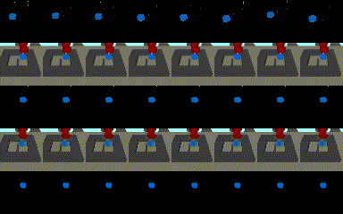

# ROLL: Visual Self-Supervised Reinforcement Learning with Object Reasoning

This is the official implementation for the paper "ROLL: Visual Self-Supervised Reinforcement Learning with Object Reasoning", to appear at Conference on Robot Learning (CoRL) 2020. [[Arxiv]()], [[Project Page](https://sites.google.com/andrew.cmu.edu/roll)]  
Authors: [Yufei Wang*](https://yufeiwang63.github.io/), Gautham Narayan*, [Xingyu Lin](https://xingyu-lin.github.io/), Brian Okorn, [David Held](https://davheld.github.io/) (* indicates equal contribution)

## Instructions
1. Create conda environment  
Create a conda environment by running `conda env create -f environment.yml`  

2. Activate the conda environment by running `source prepare.sh`.  

3. Install our customized multiworld environments   
`cd multiworld` and run `pip install .`  
(Note: this requires that you have Mujoco installed on your system)

4. Download the data we collected for pre-training the scene-VAE, the object-VAE & LSTM.    
https://drive.google.com/drive/folders/1oUYtB72Xn6n7okHgToY_onEk9NMIxfG4?usp=sharing  
Please download the entire `data` directory, and move it inside this code repo, so we have the following structure:  
ROLL-release/data/local/goals  
ROLL-release/data/local/pre-train-lstm    
ROLL-release/data/local/pre-train-vae    

5. Download the pre-trained Unet models  
https://drive.google.com/drive/folders/17_WKs7FDLfyYEtsSJAIWbIuNYGspdQ2j?usp=sharing 
pleas download all 4 models and move them to ROLL-release/segmentation/, i.e., we will have the following structure:  
ROLL-release/segmentation/pytorchmodel_sawyer_door  
ROLL-release/segmentation/pytorchmodel_sawyer_hurdle  
ROLL-release/segmentation/pytorchmodel_sawyer_pickup  
ROLL-release/segmentation/pytorchmodel_sawyer_push  
We also provide an example script for training a U-Net model from scratch on the hurdle-top environment.  
Please refer to segmentation/ReadMe.md.

6. Test the above steps: `python ROLL/launchers/launch_lstm_sawyerhurdle.py`  
All the logs will be saved at `data/local/debug/{exp-prefix-detailed-date}`  
Sepcifically, there will be:  
- `variant.json` that stores all the hyper-parameters;   
- `progress.csv` that stores all the logging information during training;  
- `itr_{epoch}.pkl` and `params.pkl` that stores the trained policy, vae, environments, and all necessary data for reruning the policy after training;    
- various debugging plots/gifs for analysis.     
If the code runs correctly, two gifs that visualize the learning process should be created very soon.

7. Running ROLL:   
`python ROLL/launchers/launch_ROLL_sawyerpush.py --no-debug`  
`python ROLL/launchers/launch_ROLL_sawyerhurdlemiddle.py --no-debug`  
`python ROLL/launchers/launch_ROLL_sawyerhurdle.py --no-debug`  
`python ROLL/launchers/launch_ROLL_sawyerdoor.py --no-debug`  
`python ROLL/launchers/launch_ROLL_sawyerpickup.py --no-debug`  
All logs will be dumped at `data/local/{exp-prefix-detailed-date}`.  
You can use `viskit data/local/exp-prefix-detailed-date}` to view the learning progress in a local port.

8. Running Skewfit:  
`python examples/skewfit/launch_skewfit_sawyer_push.py --no-debug`  
`python examples/skewfit/launch_skewfit_sawyer_push_hurdle_middle.py --no-debug`  
`python examples/skewfit/launch_skewfit_sawyer_push_hurdle.py --no-debug`  
`python examples/skewfit/launch_skewfit_sawyer_door.py --no-debug`  
`python examples/skewfit/launch_sawyer_pickup.py --no-debug`  
All logs will be dumped at `data/local/{exp-prefix-detailed-date}`.  
You can use `viskit data/local/exp-prefix-detailed-date}` to view the learning progress in a local port.

9. Pre-trained models:  
We provide a pre-trained model (which include a pre-trained scene-VAE, object-VAE/LSTM, and a pre-trained policy) of ROLL for each task. It should have been automatically downloaded when you download the data for pre-training the scene-VAE/object-VAE/LSTM in step 4.  
The pre-trained models are at `data/local/pre-trained-models/{env-name}/params.pkl`, along with a gif visulization of its performance.  
To create the gif by yourself, simply run   
`python scripts/run_goal_conditioned_policy.py --dir {dir-to-env-params.pkl} --gpu`.   
A gif visual `visual.gif` should be soon dumped at the same directory as the params.pkl file. E.g. a visual for the trained model on hurdle-bottom push env is as below:  
   
In the gif, the 1st row is the segmented goal image, the 2nd row is the image observation of the trained policy's execution, the 3rd row is the corresponding segmented object image, the 4th row is the scene-VAE reconstruction, and the 5th row is the object-VAE reconstruction.   

10. Train ROLL with pre-trained scene-VAE, objcet-VAE and LSTM.  
The default behaviour of ROLL is to retrain the scene-VAE, object-VAE and LSTM from scratch. This could take a while to run, therefore, we prvodie the option of running ROLL with pre-trained VAE models. The pre-trained models are included at `data/local/pre-trained-models/{env-name}/params.pkl`. To use pre-trained models, simply change the `vae_path` variable under `skewfit_varaint` in the launch files. E.g, for Running ROLL on Puck-Pushing-Hurdle-Bottom with pre-trained VAEs/LSTM, the `vae_path` variable should be set to `data/local/pre-trained-models/puck-push-hurdle-bottom/` (see line 31 at `ROLL/launchers/launch_ROLL_sawyerhurdlemiddle.py`) 

11. Change segmentation method:  
Ideally, ROLL should work with any segmentation code that removes the static background and robot arm. As stated in the paper, in this work we mainly use openCV background subtraction and UNet to achieve these two tasks. Any other segmentation methods that do the same thing should work.  
We have tried to write the code in a modular way so it would be easy to swap to other segmentation methods. If you want to change the segmentation method, there are a few lines of code that you will need to change:
- You can implement your new segmentation method inside `segmentation/segment_image.py`. Say it is named `new_segment_func`.  
- In `ROLL/LSTM_wrapped_env.py`, import `new_segment_func`, and change `self.segment_func` to `new_segment_func`. In the function `segment_obs`, pass in the correct parameters that are required for your segmentation function.  
- You can comment the code segment from line 174 to line 202 in `skewfit_full_experiments_LSTM.py` -- that's the code for pretraining the openCV background subtraction. If your new segmentation method does not need it, you can comment it.  
With this being said, we have not fully tested if the code would work perfectly with another segmentaion method. Feel free to open an issue or send an email to yufeiw2@andrew.cmu.edu to discuss if you encounter a bug/not sure how exactly to implement about this.

12. Code file structures/descriptions  
- ROLL/: include all code files for training object-VAE, LSTM, the policy.
    - launch_files/: the experiment launch file for each environment
    - generate_LSTM_vae_only_dataset.py: generate or load pre-generated image datasets for pre-training the object-VAE and LSTM
    - generate_vae_dataset.py: generate or load pre-generated image datasets for pre-training the scene-VAE
    - LSTM_Model.py: the pytorch module of the LSTM we used in ROLL. The LSTM structure is: image-input -> conv layers -> flattened linear feature -> vae latent (also LSTM input) -> LSTM -> LSTM output as final object embedding. There is another decoder attached to the vae latent to train the VAE using image reconstruction loss.  See the code for more details.      
    - LSTM_path_collector.py: a wrapper for collecting trajectories in the environment, should be used together with LSTM_wrapped_env.py  
    - LSTM_schedule: different online training schedules for LSTM (but we finally used the same schedul for all tasks!)  
    - LSTM_trainer.py: implement a trainer class for training the LSTM/object-VAE. Matching loss is also implemented in this file.  
    - LSTM_wrapped_env.py: a wrapper on the underlying MujocoEnv that changes the observation, reward, and goal sampling. It needs a scene-VAE and a LSTM.  
        - observation: use the scene-VAE to encode the image from the underlying MujocoEnv to be latent vectors (see figure 1 in our paper).
        - reward: first segment the next image observation and goal image using the segmentation method, and then use LSTM to encode the segmented next image observation and the segmented goal image observation to object latent embeddings, compute the reward as the distance between these two latent embeddings (see figure 1 in our paper).  
        - goal sampling: randomly sample latent vector from the object-VAE latent, and then encode it using LSTM to get the final goal latent embedding (see figure 1 in our paper).  
        - it also implements various other functions. Please see the code for details.
    - online_LSTM_replay_buffer: store the interaction trajectories with the environment. Hindsight Experience Replay is implemented when drawing smaples from the replay buffer.  
    - onlineLSTMalgorithm: perform the ROLL algoirthm. In each epoch:
        - sample (s, a, s', g, r) tuples from the replay buffer (with HER) and use it with SAC to train the policy   
        - sample random image observations from the replay buffer to train the scene-VAE  
        - sample random trajectories from the replay buffer to train the LSTM  
    - skewfit_full_experiments_LSTM.py: parsing all arguments from the launch file, pre-train (or load) scene-VAE/object-VAE/LSTM, pre-train openCV background subtraction module, prepare everything for the experiments and launch it.  
- segmentation/: include all code files for doing the segmentation, training background subtractor, training UNet.  
    - unet/: implementation of UNet in pytorch.           
    - DataLoader.py: pytorch dataloader for training UNet  
    - segment_image.py: the key file that implements unknown object segmentation. 
    - test_script.py: test a trained UNet model.
    - train_script.py: train a UNet model.  
    - train_data_generation.py: generating training data for UNet.    
    - ReadMe.md: instructions for how to use the code to train the UNet.
- test_latent_space/: include code files that create debugging plots for the learned vae/lstm latent space
- scripts/:  
    - run_goal_conditioned_policy: replay trained policies  
    - test_multiworld.py: visualizations of the environments   
    - test_presampled_goals.py: view the generated goal images for door opening and object pickup env  
    - test_prestored_data.py: view the pre-generated vae training data  

## References
- The code is developed largely based on the Skew-Fit implementation from the official release: https://github.com/vitchyr/rlkit
- The multworld environments are based on the official release: https://github.com/vitchyr/multiworld
- The U-Net implementation is based on https://github.com/milesial/Pytorch-UNet

